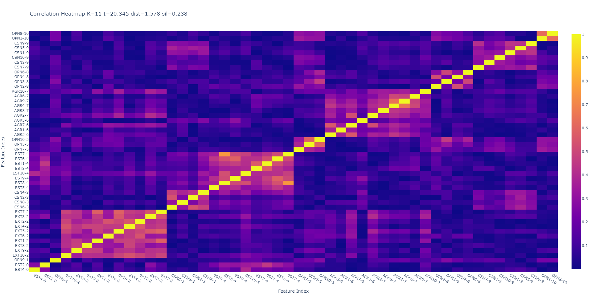
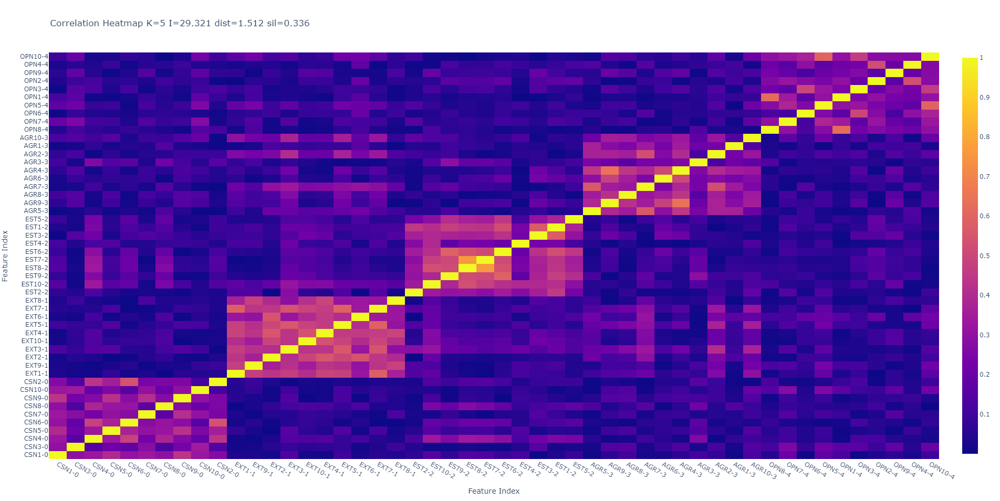
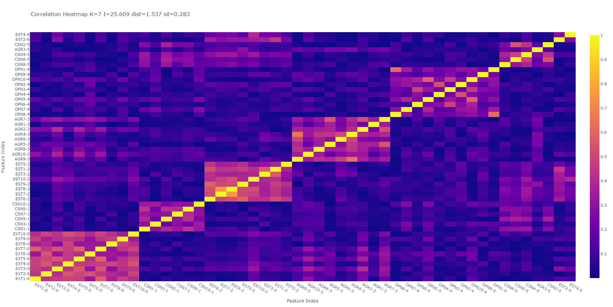
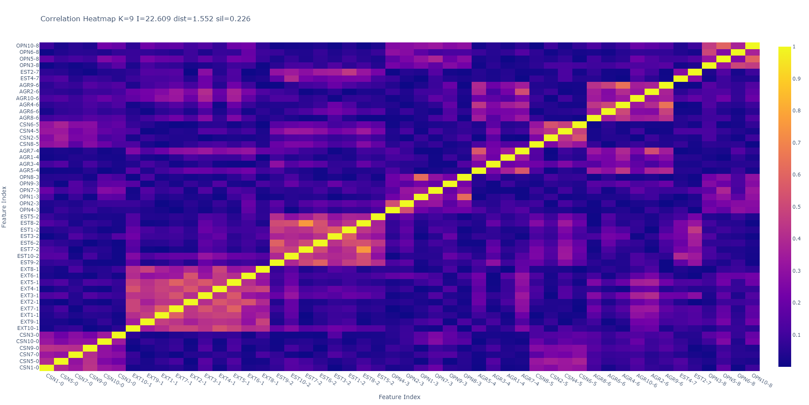
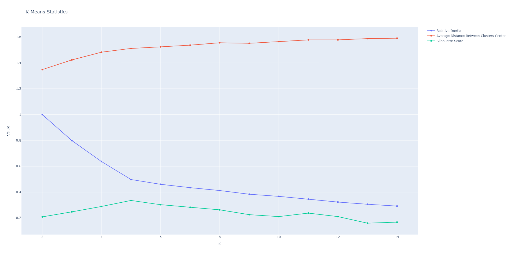

# BIG-5 Reclustering Project

## Overview

Welcome to the BIG-5 Reclustering project! Our goal is to analyze and understand the clusterization of the Big Five personality traits – Openness, Conscientiousness, Extraversion, Agreeableness, and Neuroticism. By 
exploring various clustering techniques, we aim to discover new ways to group individuals with similar personality traits, gaining valuable insights into human behavior and psychology.

**This project is part of the HUJI University Neuropsychiatry class.**

**Authors: Raz Zeevy, Tomer Yakobi, Ayala Cohen, Shir Levi, Bar Friedman**

## Introduction

The Big Five personality traits, often referred to as the "Big Five" or simply "Five Factor Model," are widely recognized and extensively studied in psychology. They provide a comprehensive framework for describing and understanding human personality. Our project seeks to delve deeper into the clustering of these traits to gain new perspectives on how they relate to each other and influence human behavior.

## Project Structure

The project consists of the following key components:

1. **Main Analysis Script (`main.py`):** This Python script performs the clustering analysis using the KMeans algorithm on the Big Five personality traits data.

2. **Personality Traits Data (`data-final.csv`):** The dataset contains responses to personality assessment questions that quantify the Big Five traits for a group of individuals.

3. **Notebook (`Neuro.ipynb`):** An optional Jupyter Notebook that contains additional analyses or experimentation.

4. **Plots (`plots` directory):** This directory contains generated heatmaps and statistics plots for different cluster configurations.

## Clustering Analysis

Our project revolves around clustering analysis, specifically using the KMeans algorithm. By employing this technique with varying numbers of clusters (k), we explore how individuals with similar personality traits group together.

### Key Tests and Findings

1. **Heatmap Clusterization Visualization:** We visualize the correlation between personality traits within each cluster using heatmaps. This provides insights into how certain traits tend to be positively or negatively associated within a cluster.

2. **KMeans Statistics Plot:** The KMeans statistics plot displays the inertia (within-cluster sum of squares), average distance between cluster centers, and silhouette score for different k values. This aids in determining the optimal number of clusters.

## Understanding the Big Five

The Big Five personality traits represent five major dimensions of human personality. Here's a brief explanation of each trait:

1. **Openness:** This trait reflects the individual's openness to new experiences, imagination, and curiosity.

2. **Conscientiousness:** Individuals high in conscientiousness tend to be organized, responsible, and goal-oriented.

3. **Extraversion:** Extraversion measures the degree of social interaction and outgoing behavior.

4. **Agreeableness:** This trait signifies kindness, empathy, and cooperativeness towards others.

5. **Neuroticism:** Neuroticism represents emotional stability. High neuroticism indicates a tendency towards anxiety and emotional sensitivity.

## Project Results

Below are the plots generated during our analysis:

### Heatmap for k=11:

### Heatmap for k=5:

### Heatmap for k=7:

### Heatmap for k=9:

### KMeans Statistics Plot:

## Conclusion

Our BIG-5 Reclustering project aims to enhance our understanding of the Big Five personality traits and their clusterization patterns. By leveraging advanced data analysis techniques, we strive to discover new insights into human behavior and personality. The results obtained from the clustering analysis and visualizations will contribute to the broader field of psychology and personality research.

Thank you for exploring our project, and we hope our work enriches your understanding of personality traits and clustering techniques.

---
